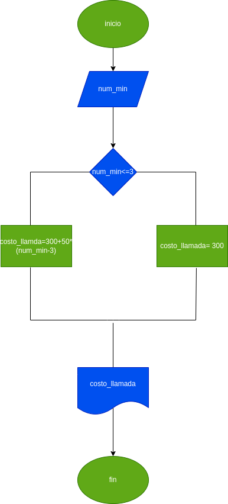

# llamada_telefonica
programa para calcular el costo de una llamada telefonica
ingresar el tiempo de duracion de una llamada telefonica y determinar la cantidad a pagar, deacuerdo con lo siguiente:
- toda llamada que dure tres minutos o menos tiene un costo de  300 pesos
- cada minuto adicional cuesta 50 pesos
# Diseño

## Diagrama de Flujo

